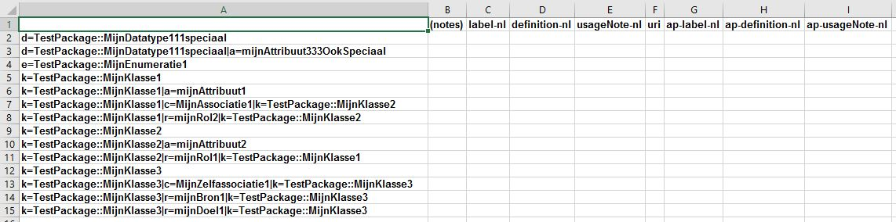
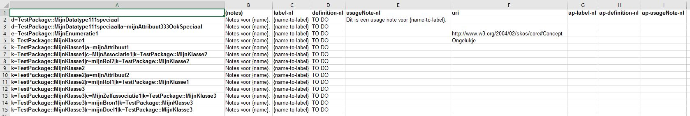
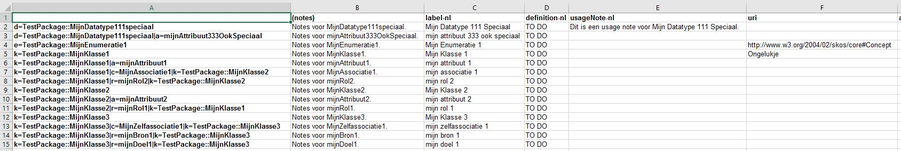

# TagsAndNotes

## Inleiding
Dit is een tool om het editeren van tags en notes in Enterprise Architect (EA) modellen binnen OSLO context te vergemakkelijken en te automatiseren.

De tool bestaat uit een Excel workbook met macro's: **TagsAndNotes.xlsm**.

Voor het maken van deze tool werd inspiratie gehaald uit [Geert Bellekens' Simple VBA Excel to EA importer](https://bellekens.com/2018/10/12/simple-vba-excel-to-ea-importer-v4-2/).

Het basisprincipe om macro's te linken aan het Excel menu systeem werd hieraan ontleend (met dank).

Verder is de tool totaal verschillend uitgewerkt:
- Tags worden niet geïdentificeerd door middel van EA's GUIDs, maar door een eigen formaat, met leesbare referenties, die uniek zijn binnen een package en bovendien geschikt zijn voor "menselijke consumptie".
Dit laat uitwisseling toe tussen verschillende modellen waarin dezelfde items voorkomen.
- Ook notes op items (niet te verwarren met notes op tags) worden behandeld.
- Er is ondersteuning voor symbolische waarden ter ondersteuning van automatisering bij het initiëel toekennen van waarden aan tags, in OSLO-stijl.
- Er is ondersteuning voor het verwijderen van tags / wissen van notes.
- Het interfacen met EA en met Excel is totaal anders.

## Handleiding
Ben je enkel van plan om tags in te vullen in een bestaande tabel, ga dan onmiddellijk naar [hier](#tags-en-notes-invullen).

### Voorbereiding
Maak een kopie van TagsAndNotes.xlsm naar je eigen werkomgeving.
In praktijk is één kopie nodig hebben per package en per EA model.
Een goede bestandsnaam is dus `<EA-model-bestandnaam>-<packagenaam>.xlsm`.

Hieronder noemen we dit bestand eenvoudigweg het "het .xlsm bestand".

Bij het voor de eerste keer openen van dit bestand wordt allicht een beveiligingswaarschuwing gegeven.
Klik dan op "Enable Content".

### Technische stappen om de macro's operationeel te maken
Dit moet één keer gebeuren per computer waarop je werkt en is alleen mogelijk als EA op je computer geïnstalleerd is.

- Zorg er voor dat Visual Basic for Applications (VBA) toegang heeft tot de EA library:
  - Open het menu View -> Macro's -> View Macro's.
  - Selecteer eender welke macro en klik "Edit"; VBA opent.
  - In VBA: open het menu Tools -> References.
  - Vink aan: "Enterprise Architect Object Model 2.10" (Deze referentie verwijst bijvoorbeeld naar locatie C:\Program Files (x86)\EA\EA.TLB)
  - Klik OK en sluit VBA.
- Zorg er voor dat de macro's bereikbaar zijn via het menu systeem:
  - Open het menu File -> Options -> Customize the Ribbon.
  - Onder 'Customize the Ribbon' (rechter kolom), selecteer 'Main Tabs'.
  - In de selectie daaronder, vink aan: "Add-ins" en sluit af.

### Tags en notes ophalen uit EA (pull)
Het resultaat van deze bewerking is een nieuwe worksheet met naam "TagsAndNotes".
Een eventuele vroeger aanwezige worksheet met deze naam wordt verwijderd.
Neem dus vooraf een backup als je vroegere inhoud nog even wil bewaren.

Stappen:
- Open het menu Add-ins en klik op **Pull from EA**.
- Doe zoals de prompts vragen:
  - Open in EA het modelbestand waaruit gelezen moet worden; opgelet: er mag maar één instance van EA open staan.
  - Selecteer in de EA project browser het package waaruit gelezen moet worden.
- Wacht op de melding dat de bewerking klaar is.

**Voorbeeld input package:**

**Voorbeeld resultaat, na een eerste pull, indien nog geen tags en notes ingevuld waren in het model:**

Er zijn kolomhoofdingen met de namen van enkele populaire tags, voorafgegaan door het speciaal geval "(notes)".

Er zijn rijhoofdingen met unieke identificatie van elk in OSLO context mogelijk te behandelen item, met volgende syntax:
- Een hoofding bestaat uit één of meerdere velden, gescheiden door "|".
- Voor klassen, datatypes en enumeraties is er één veld (1):
  - Respectievelijk "k", "d" of "e", gevolgd door de UML naam.
- Voor attributen zijn er twee velden:
  - Een veld voor het item waartoe het attribuut behoort, zoals in (1).
  - "a" gevolgd door de UML naam van het attribuut.
- Voor connectoren (enkel deze met niet-lege UML naam worden in acht genomen) zijn er drie velden:
  - Een veld voor het item aan de source kant van de connector, zoals in (1).
  - "c" gevolgd door de UML naam van de connector.
  - Een veld voor het item aan de target kant van de connector, zoals in (1).
- Voor rollen (enkel deze met niet lege UML naam worden in acht genomen) zijn er drie velden:
  - Een veld voor het item waarin de rol zal voorkomen in de specificatie (dus aan de andere kant van de connector), zoals in (1).
  - "r" gevolgd door de UML naam van de rol.
  - Een veld voor het item aan dezelfde kant van de connector, zoals in (1).

### Tags en notes invullen
Vul in naar believen, eventueel gebruik makend van symbolische waarden of speciale instructies.

Volgende symbolische waarden worden ondersteund:
- `{name}`: de UML naam van het item.
- `{name-to-label}`: een conversie op de UML naam, geschikt om te gebruiken als label (of om naar een label te verwijzen).

Volgende speciale instructies worden ondersteund:
- `d!`: de tag moet worden verwijderd / de notes moeten leeggemaakt worden.

Indien nodig, voeg extra kolommen toe, bijvoorbeeld voor "package", "ignore", "ap-codelist", ...
De volgorde van de kolommen is van geen belang.

**Voorbeeld van een ingevulde tabel**

In dit voorbeeld wordt gebruik gemaakt van de ondersteunde symbolische waarden, maar (nog) niet van speciale instructies.

Merk op dat ap-label-nl, ap-definition-nl, ap-usageNote-nl (tags voor een applicatieprofiel) niet hoeven ingevuld worden
als de waarden label-nl, definition-nl, usageNote-nl (tags voor een vocabularium) ook mogen gelden voor het applicatieprofiel.
Maar dat is een feature van de toolchain en niet van deze tool...

### Tags en notes opsturen naar EA (push)
Het resultaat van deze bewerking is dat tags en notes in het geselecteerde package van het in EA openstaande model worden toegevoegd of aangepast
volgens de inhoud van de corresponderende cel in worksheet "TagsAndNotes", na verwerking van eventuele symbolische waarden.

Dit gebeurt enkel voor niet-lege cellen.
In geval van lege cellen worden dus eventueel intussen manueel aangebrachte toevoegingen in EA behouden.
Een cel leegmaken is dus ook niet de manier om inhoud te wissen in het model (daarvoor dient dus de speciale instructie `d!`).

Stappen:
- Open het menu Add-ins en klik op **Push from EA**.
- Doe opnieuw zoals de prompts vragen:
  - Open in EA het modelbestand waarnaar geschreven moet worden; opgelet: er mag maar één instance van EA open staan.
  - Selecteer in de EA project browser het package waarnaar geschreven moet worden.
- Wacht op de melding dat de bewerking klaar is.

### Tips & tricks
- Haal altijd tags en notes op uit EA (pull) alvorens te editeren in de tabel, om zo in sync te zijn met de laatste toestand van het model.
- Maak zoveel mogelijk gebruik van de symbolische waarden {...} bij het editeren van cellen. Dit spaart hardcoded werk uit en levert consistente tags op.
- Let op met speciale karakters eigen aan de Windows omgeving. Typisch zijn de drie puntjes ... die als één karakter worden voorgesteld. Wijzig deze manueel naar gewone karakters!
- Maak bij het aanpassen van eerdere inhoud altijd gebruik van "Replace" in Excel, zodat alle voorkomens van te vervangen inhoud consitent gewijzigd worden.
- Voer bij voorkeur na elke push ook een nieuwe pull uit, om het resultaat te verifiëren en om eventuele tussentijdse aanpassingen aan het model vast te stellen.
Hernoem eerst huidige worksheet "TagsAndNotes" als backup of referentie voor vergelijking.

## Ter illustratie

### Een tweede pull
Dit is het resultaat van een pull na de push met de gegevens hoger ingevuld:

Alle cellen zijn geüpdatet; symbolische waarden zijn vervangen door de effectieve waarden.

### Een tweede push
Met volgende voorbeeld input worden alle notes en één uri verwijderd (speciale instructie `d!`):

### Een derde pull
Dit is het resultaat van een pull na de voirge push:

Stel vast de speciale instructie `d!` gewerkt heeft.

