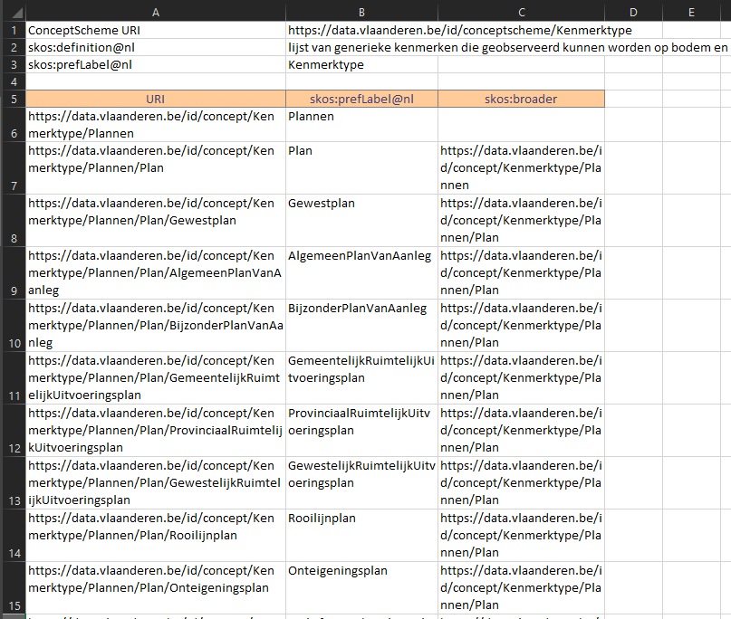

# Taxonomie Excel Macro

## Inleiding

Dit is een tool om het editeren van taxonomieën op basis van SKOS te vergemakkelijken en te automatiseren. 
De Excel taxonomie wordt omgezet in een excel formaat dat naar bv. een ttl bestand kan worden geconverteerd op [SKOS-play Convert](https://skos-play.sparna.fr/play/convert).
Hierna kan dit ttl bestand worden gevisualiseerd op [SKOS Play!](https://skos-play.sparna.fr/play/upload). 

In example_taxonomy.xlsm vind je een voorbeeldje van een taxonomie. 

Op de eerste drie lijnen worden de gegevens van de SKOS Conceptscheme behandeld:
  - ConceptScheme URI
    - De URI van de ConceptScheme
  - Concept URI
    - De Base URI voor alle Concepts
  - skos:definition@nl
    - De definitie van het schema (default is nl)
  - skos:prefLabel@nl
    - Het Label van het schema

Vanaf lijn 5 wordt de taxonomie weergegeven in niveaus of levels. Dit is vrij in te vullen naargelang de taxonomie. Er kunnen gerust niveaus/levels worden toegevoegd als kolom ter uitbreiding. 

**De lijnen zijn wel hardgecodeerd in de macro. Dus de Conceptscheme info op lijn 1-2-3, de niveaus op lijn 5 en de taxonomie startende vanaf lijn 6.**

## Omzetten naar SKOS Play Excel

Om de macro te runnen, ga in Excel naar **View/Beeld** en druk op **Macros**. Selecteer **excel_to_skos** en druk op Run. Er wordt een nieuwe Excel Sheet aangemaakt met als naam Skos. Deze neemt de Conceptscheme velden over van de vorige sheet. De Taxonomie is omgevormd naar SKOS formaat, met drie velden:

- URI
  - De URI van het concept, met als Base URI de Concept URI, aangevuld met de labels van de hoger gelegen Concepts.
  - De reden waarom de bovenliggende Concepts mee worden genomen in de URI, is omdat dezelfde Concepts onder verschillende takken worden ondergebracht. Het concept **Plan**           behoort bv. tot **Plannen**, maar ook tot **Vergunningen**. Als de concepten onder **Plan** dan een verwijzing hebben naar dezelfde URI, kan de boomstructuur niet worden         gemaakt. Hierdoor moet er een opsplitsing worden gemaakt voor **Plannen/Plan** en **Vergunningen/Plan**. 
- skos:prefLabel@nl
  - Het label van het concept. 
  - De default is @nl. Dit moet manueel worden aangepast indien een andere taal gewenst is. 
- skos:broader
  - De URI van het bovenliggende concept. Inder er geen skos:broader is, is het een topConcept. 

Deze Excel kan worden geconverteerd naar een ttl bestand op [SKOS-play Convert](https://skos-play.sparna.fr/play/convert). Indien nodig, kunnen er nog aanpassingen worden gedaan aan de structuur indien er extra velden nodig zijn (e.g. prefix, definition...). Hiervoor kan je best eens de SKOS Play documentatie raadplegen onderaan de webpagina. 

Het verkregen ttl bestand kan dan worden gevisualiseerd op [SKOS Play!](https://skos-play.sparna.fr/play/upload). 

## Opmerkingen

- Dit is een eerste versie van deze tool, met enkel de basis-eigenschappen, gebaseerd op de taxonomie beschreven in example_taxonomy.xlsm . In een volgende versie zal er           ondersteuning zijn voor meerdere velden.
- Momenteel zijn de URI's beschreven volgens de hiërarchie. Idealiter heb je een URI in de vorm van *basis_uri#Concept*, maar vanwege duplicaten in de prefLabels is dit niet       mogelijk om hieruit een SKOS taxonomie te creëren. 
