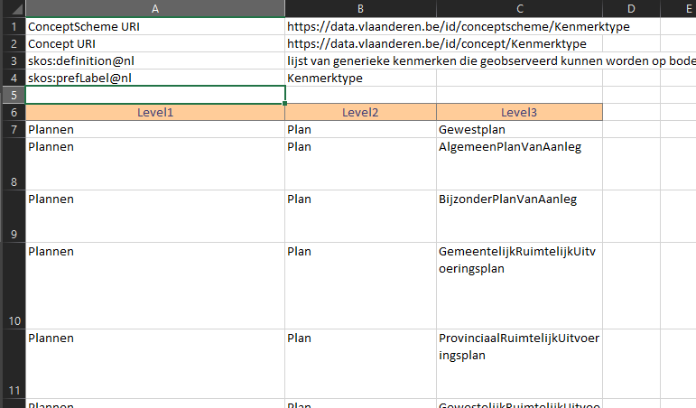

# Taxonomie Excel Macro

Dit is een tool om het editeren van taxonomieën op basis van SKOS te vergemakkelijken en te automatiseren. 
De Excel taxonomie wordt omgezet in een excel formaat dat naar bv. een ttl bestand kan worden geconverteerd op [SKOS-play Convert](https://skos-play.sparna.fr/play/convert).
Hierna kan dit ttl bestand worden gevisualiseerd op [SKOS-play Play!](https://skos-play.sparna.fr/play/upload). 

In example_taxonomy.xlsm vind je een voorbeeldje van een taxonomie. 

